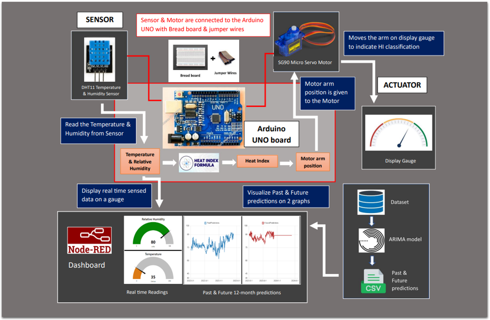

# IoT_Project

This group project is related to the 'Internet of Things and Big Data Analytics' module in 1st semester of 4th year. In the project, an IoT system was created to assess the health of the current heat index, display real-time relative humidity data, and provide predictive humidity information for the next 12 months, all accessible through a user-friendly dashboard interface.

## Overall architecture

## Tools & technologies
- Arduino
- Node-RED
- ARIMA modeling
